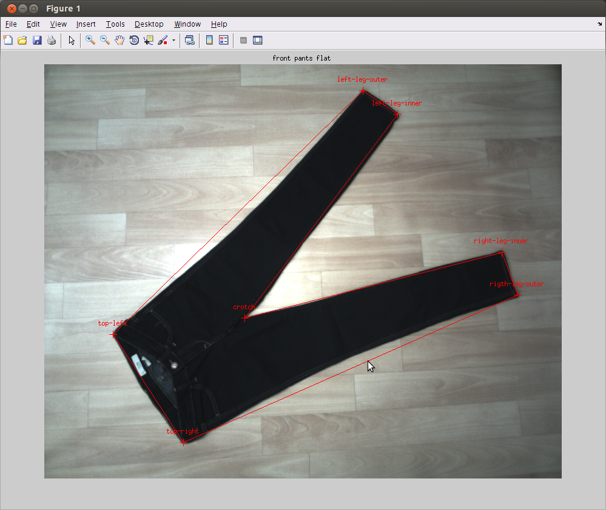
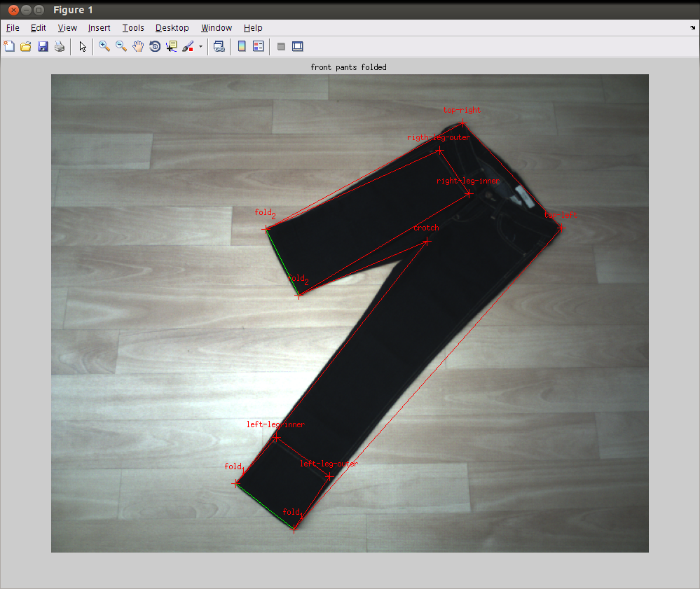

CTU Color and Depth Image Dataset of Spread Garments
====================================================

This repository contains tools and documentation for publicly available
benchmark datasets for testing and evaluation of garment segmentation,
recognition and folding algorithms -- the [CloPeMa Garment Dataset][web]. The
datasets are free for research and educational purposes only and can be used in
scientific publications at the condition of respecting the requested citation
acknowledgment.

Tools
=====

The annotation is stored in the [YAML][] markup language and The [yamlmatlab][]
library is used for YAML parsing. The library is included in this repository.

In order to get you started we have provide a simple Matlab example that will
read and show the annotation.

Start Matlab in the `src` directory and run the following command:

```
>> example
```

It will display two images one image of pants laying flat on the and folded.




Contributing
============

You are welcome to contribute by sending a pull request.

Citation Request
================

If you are using this dataset some of the code in your project, please include
the following citation.

```
Wagner, L., and Krejčová, D. CTU color and depth image dataset of spread
garments. Research Report CTU-CMP-2013-25, Center for Machine Perception,
K13133 FEE Czech Technical University, Prague, Czech Republic, September 2013.
```


[web]: http://clopema.felk.cvut.cz/public_data.html
[YAML]: http://yaml.org
[latex]: http://www.latex-project.org
[latexmk]: http://www.ctan.org/pkg/latexmk/
[yamlmatlab]: http://code.google.com/p/yamlmatlab/
